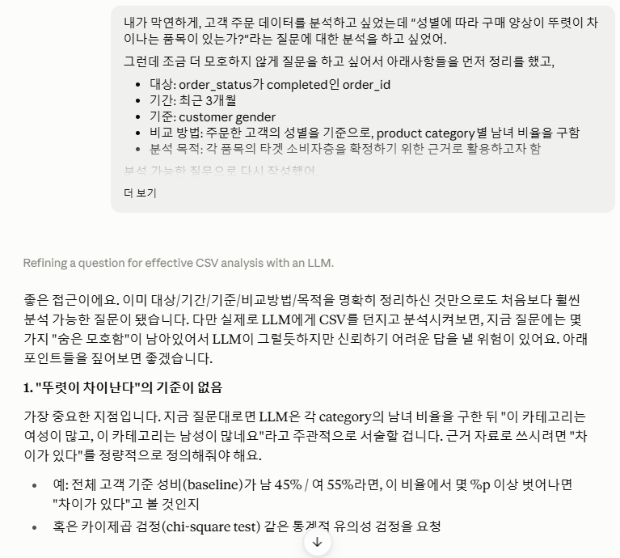
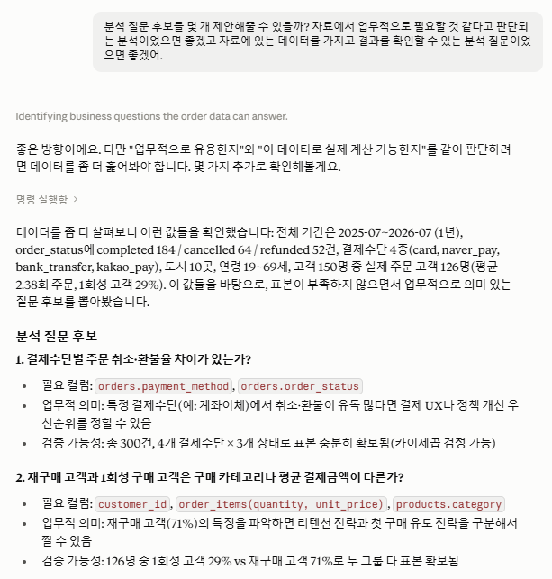

# Chapter 01 제출 답안. AI와 함께하는 데이터 분석의 시작

> 이 파일은 Chapter 01 실습 결과를 정리하여 제출하기 위한 학생용 템플릿입니다.  
> 강사 저장소의 원본 템플릿을 직접 수정하지 말고, 자신의 PC에 복사한 뒤 작성합니다.

---

## 0. 제출 정보

- 이름: 권영서
- GitHub ID: kys02101-cmd
- 개인 저장소명: `llm-data-analysis-study`
- 작성일: 26-09-13
- 사용한 LLM: claude

### 최종 제출 URL

```text
https://github.com/kys02101-cmd/llm-data-analysis-study/blob/main/chapter01/chapter01.md
```

---

## 1. 원래 업무 질문

### 내가 선택한 막연한 질문

```text
성별에 따라 구매 양상이 뚜렷이 차이나는 품목이 있는가?
```

### 왜 이 질문이 모호하다고 생각했는가?

- 대상: order_status가 completed인 order_id
- 기간: 최근 3개월
- 기준: customer gender
- 비교 방법: 주문한 고객의 성별을 기준으로, product category별 남녀 비율을 구함 
- 분석 목적: 각 품목의 타겟 소비자층을 확정하기 위한 근거로 활용하고자 함

### 분석 가능한 질문으로 다시 작성

```text
최근 3개월간 order_status가 'completed'인 주문을 대상으로, 고객 gender('M'/'F', 결측 제외)별 product category별 주문 비율이 어떻게 되는가?
전체 고객(baseline) 성비를 먼저 계산한 후 각 category별 성비를 계산하고, baseline 대비 편차(%p)를 함께 제시하라.
표본 수(주문 건수)가 30건 미만인 category는 별도로 표시하라.
편차가 ±10%p 이상인 category를 "성별 편중 카테고리"로 분류하고, 카이제곱 검정으로 통계적 유의성(p<0.05)도 확인하라.
주문 건수 기준 성비와 함께, 매출액 기준 성비도 함께 제시하라.
결과는 표(category, n, 남성비율, 여성비율, baseline대비 편차, p-value, 매출액기준 비율)로 정리하고, 그 표를 근거로 각 category의 타겟 소비자층을 서술하라.
```

### 결과 관찰

기존 질문은 정확히 어떤 판단 기준을 가지고 어떤 데이터를 활용하여 분석 결과를 도출해야 하는지에 대한 내용이 많이 부족했기 때문에 의도하지 않은 데이터 활용 등이 발생할 수 있을 거라 생각이 되었습니다. 그래서 혼자서 비교 방법이나 분석 대상을 정리하여 다듬은 질문인 "최근 3개월 간 order_status가 completed인 주문들의 고객 성별을 정리한 결과를 바탕으로, product category별 남녀 비율은 어떻게 되는가? 각 category의 타겟 소비자층은 어떤 집단이라고 보여지는가?"를 클로드에 더 다듬어달라 요청하였습니다. 그 결과 위와 같은 최종 분석용 질문을 완성시킬 수 있었습니다.

### 나의 해석과 판단

클로드는 분석을 위한 질문이라기에 여전히 남아있는 모호함을 진단하고 이에 대한 솔루션을 제공해주었기 때문에 훨씬 정교한 질문을 완성시킬 수 있었다 생각합니다. 가장 핵심적인 지적은 "뚜렷이 차이난다"의 기준이 제공되지 않아 AI가 임의로 판단할 여지가 있다는 부분이었습니다. 이는 구하고자 하는 답의 핵심적인 부분이기 때문에 이 부분을 카이제곱 검정으로 통계적 유의성을 확인하라는 구체적 기준을 추가함으로써 분석 결과의 설득력을 높일 수 있었고, 따라서 더 적합하다 판단했습니다.

### 업무·분석적 의미

해당 분석의 결과는 분석 목적에 기술했듯, 각 품목의 타겟 소비자층을 확정하기 위한 근거로 활용할 수 있다고 생각했습니다. 예를 들어, 만약 스포츠용품에서 남성 고객의 구매 비율이 현저히 높다면 남성을 타겟 소비자로 잡고 추후 마케팅을 진행할 때 남성에게 접근이 용이한 채널을 활용하는 전략에 대한 근거가 될 수 있습니다.
또한 연령별 분석을 추가로 진행함으로써 더 세부적인 소비자층 분류를 시도할 수 있습니다.

### 한계와 추가 확인 사항

현재 질문만으로 알 수 없는 것은 성비 차이가 있다고 해서 그게 곧 이 카테고리는 이 성별을 타겟팅해야 한다는 결론으로 바로 이어지긴 어려울 수 있다는 것입니다. 나이, 지역, 마케팅 채널 등 다른 변수가 성별과 얽혀 있을 수 있기 때문에, 해석 시 이 한계를 명시하거나 이어지는 분석을 통해서 나이와 지역 변수도 포함시켜야 설득력을 높일 수 있을 것입니다.

### Evidence



---

## 2. 질문과 필요한 데이터 연결

### 필요한 데이터 파일

- [x] `customers.csv`
- [x] `products.csv`
- [x] `orders.csv`
- [x] `order_items.csv`

### 필요한 컬럼 후보

| 파일 | 필요한 컬럼 | 필요한 이유 |
| --- | --- | --- |
| orders | order_id, customer_id, order_date, order_status | order_status: "completed" 필터링, order_date: "최근 3개월" 필터링 |
| order_items | order_id, product_id, quantity, unit_price | order_item 단위로 집계, 매출액 = quantity × unit_price로 계산 |
| products | product_id, category | category별로 묶기 위한 키 |
| customers | customer_id, gender | 성별 기준 분석의 핵심 |

### 데이터 연결 관계

```text
customers (gender) 
   ↓ customer_id
orders (order_status, order_date)
   ↓ order_id
order_items (quantity, unit_price)
   ↓ product_id
products (category)
```

### 결과 관찰

customers → orders → order_items → products, 총 4개 테이블을 모두 연결해야 "성별 × category" 교차표를 만들 수 있다는 것을 확인했습니다. 4개 테이블을 연결해야 했기 때문에 데이터 연결 고리를 구성하는 작업이 조금 까다로웠지만 여러 데이터를 가로질러 종합적인 분석을 할 수 있겠다고 생각했습니다. 

### 나의 해석과 판단

데이터에 결측치가 없다는 가정 하에 대부분 질문에 답을 내릴 수 있을 것으로 판단했습니다.

### 업무·분석적 의미

질문과 데이터 구조를 먼저 연결하는 작업이 중요하다 생각되었던 부분은, 실제 데이터를 열어보기 전까지는 질문으로 구성했던 계산이 실제로 가능한지, 정의한 개념이 데이터에 어떻게 매핑되는지 등을 알 수 없었기 때문입니다. 따라서 질문을 잘 작성했다고 하더라도 실제 데이터를 가지고 구조를 짜는 작업을 거치면서 질문을 조정하거나 하는 작업을 진행할 수 있기 때문에 중요한 것 같습니다.

### 한계와 추가 확인 사항

결측치가 존재하는지 확인할 필요가 있습니다. 또한 제가 제시한 필터링 조건으로 충분한 표본 수가 확보되는지도 확인해야 합니다.

### Evidence

필요한 경우 관계도 또는 데이터 파일 확인 화면을 첨부하세요.


---

## 3. LLM에게 분석 질문 후보 요청

### 사용 목적

```text
왜 LLM을 사용했는지 작성하세요.
```

### 사용한 Prompt

```text
여기에 실제 사용한 Prompt를 붙여 넣으세요.
단, 개인정보·API Key·Secret은 포함하지 마세요.
```

### LLM 답변 요약

LLM의 전체 답변을 그대로 복사하지 말고 핵심 제안 3~5개를 요약하세요.

1.
2.
3.
4.
5.

### 결과 관찰

LLM이 어떤 방향의 질문을 주로 제안했는지 사실 위주로 작성하세요.

### 나의 해석과 판단

좋았던 제안과 그대로 사용하기 어려운 제안을 구분해서 작성하세요.

### 업무·분석적 의미

LLM이 분석 시작 단계에서 어떤 도움을 줄 수 있다고 생각하는지 작성하세요.

### 한계와 추가 확인 사항

LLM 답변에서 실제 데이터로 검증해야 할 내용을 작성하세요.

### Evidence



---

## 4. LLM 제안 검증

LLM 제안 중 하나 이상을 선택해 검토합니다.

| 검증 항목 | 확인 내용 |
| --- | --- |
| 선택한 LLM 제안 |  |
| 필요한 파일 |  |
| 필요한 컬럼 |  |
| 계산 범위 |  |
| 실제 데이터 확인 필요 여부 |  |
| 원인 단정 여부 |  |
| 최종 판단 | 사용 / 수정 후 사용 / 보류 |

### 내가 수정한 내용

```text
LLM 제안을 수정했다면 무엇을 어떻게 바꿨는지 작성하세요.
```

### 결과 관찰

검증 과정에서 확인된 사실을 작성하세요.

### 나의 해석과 판단

왜 `사용 / 수정 후 사용 / 보류` 중 해당 결정을 내렸는지 작성하세요.

### 업무·분석적 의미

LLM 제안을 검증하지 않고 바로 사용하는 경우 어떤 문제가 생길 수 있는지 작성하세요.

### 한계와 추가 확인 사항

아직 실제 데이터로 검증하지 못한 부분을 명확히 작성하세요.

### Evidence


---

## 5. Prompt Log

- 사용 목적:
- 입력 Prompt 요약:
- LLM 답변 요약:
- 실제 반영 여부:
- 사람이 검증한 항목:
- 사람이 수정한 내용:
- 남은 확인 사항:

### 결과 관찰

LLM 사용 기록에서 어떤 의사결정 과정을 확인할 수 있는지 작성하세요.

### 나의 해석과 판단

Prompt Log를 남기는 것이 왜 필요한지 자신의 말로 작성하세요.

### Evidence


---

## 6. 개인정보와 Secret 보호 확인

다음 항목을 확인합니다.

- [ ] 실제 이름·이메일·전화번호 등 고객 개인정보를 Prompt에 사용하지 않았습니다.
- [ ] API Key를 코드나 Notebook에 직접 작성하지 않았습니다.
- [ ] `.env` 실제 내용을 캡처하거나 업로드하지 않았습니다.
- [ ] GitHub Token, 비밀번호, 내부 URL이 캡처에 보이지 않습니다.
- [ ] 제출 전 이미지까지 다시 확인했습니다.

### 나의 판단

이번 실습에서 어떤 정보는 LLM 또는 Public GitHub에 올리면 안 된다고 판단했는지 작성하세요.

---

## 7. Chapter 01 Notebook 확인

Notebook:

```text
notebooks/ch01_ai_data_analysis_intro.ipynb
```

### 내 환경 상태

- [x] 아직 환경설정 전이라 Notebook 위치만 확인했습니다.
- [ ] 환경설정이 완료되어 Notebook을 직접 실행했습니다.

### 환경설정 완료 학생만 작성

#### 실행한 코드

```python
from pathlib import Path

import pandas as pd
import numpy as np
import matplotlib.pyplot as plt
import seaborn as sns

DATA_DIR = Path('../data/raw')
sns.set_theme(style='whitegrid')
```

#### 실행 결과

```text
오류 없이 실행되었는지 작성하세요.
```

#### 결과 관찰

실행 결과에서 확인한 사실을 작성하세요.

#### 나의 해석과 판단

현재 Notebook이 본격 분석이 아니라 starter scaffold라는 의미를 자신의 말로 설명하세요.

#### 한계와 추가 확인 사항

Chapter 02 또는 Chapter 03에서 추가로 확인해야 할 내용을 작성하세요.

#### Evidence


> 환경설정 전이라면 이 이미지는 생략할 수 있습니다.

---

## 8. Chapter 01 최종 해석

### 이번 장에서 가장 중요하다고 생각한 내용

```text
자신의 말로 3~5문장 작성하세요.
```

### LLM을 데이터 분석에 사용할 때 가장 조심해야 할 점

```text
자신의 판단을 작성하세요.
```

### 사람과 LLM의 역할 차이

| 항목 | LLM이 도울 수 있는 부분 | 사람이 책임져야 하는 부분 |
| --- | --- | --- |
| 질문 정의 |  |  |
| 데이터 확인 |  |  |
| 코드 작성 |  |  |
| 결과 해석 |  |  |
| 최종 판단 |  |  |

### 다음 Chapter에서 확인하고 싶은 것

```text
이번 장에서 남은 의문이나 Chapter 02~03에서 확인하고 싶은 내용을 작성하세요.
```

---

## 9. 최종 제출 체크리스트

- [ ] 원래 업무 질문과 구체화한 분석 질문을 작성했습니다.
- [ ] 질문에 필요한 데이터 파일과 컬럼 후보를 정리했습니다.
- [ ] LLM Prompt와 답변 요약을 작성했습니다.
- [ ] LLM 제안을 실제 데이터 관점에서 검증했습니다.
- [ ] 각 핵심 STEP의 결과 관찰을 작성했습니다.
- [ ] 각 핵심 STEP의 나의 해석과 판단을 작성했습니다.
- [ ] 업무·분석적 의미를 작성했습니다.
- [ ] 한계와 추가 확인 사항을 작성했습니다.
- [ ] 핵심 실행 Evidence 이미지를 첨부했습니다.
- [ ] 이미지가 Markdown에서 정상 표시됩니다.
- [ ] 개인정보가 없습니다.
- [ ] API Key·Secret·Token이 없습니다.
- [ ] 개인 GitHub 저장소에 업로드했습니다.
- [ ] GitHub에서 Markdown과 이미지가 정상 표시됩니다.
- [ ] 아래 최종 파일 URL이 정상적으로 열립니다.

### 최종 파일 URL

```text
https://github.com/kys02101-cmd/llm-data-analysis-study/blob/main/chapter01/chapter01.md
```

---

## 10. 교수자 확인용 요약

### 수행 상태

- [ ] COMPLETE
- [x] PARTIAL

### 내가 가장 중요하게 내린 판단 1개

```text
여기에 작성하세요.
```

### 아직 확인이 필요한 내용 1개

```text
여기에 작성하세요.
```
